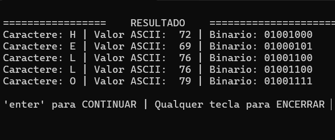
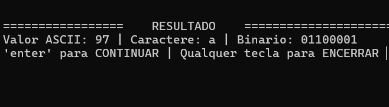

# ASCII Binary Inspector

Um projeto em linguagem C desenvolvido para explorar conceitos de baixo nível como tabela ASCII, representação binária e manipulação de bits diretamente no terminal.

---

## Preview

## ASCII Converter

## Funcionalidades

* Leitura de caracteres digitados pelo usuário
* Conversão de caracteres para:

  * Valor ASCII
  * Representação binária
* Conversão de valores ASCII (0-255) para caracteres
* Interface interativa no terminal
* Uso de funções para modularização do código

---

## Conceitos praticados

* `getchar()`
* `EOF` (`Ctrl + Z`)
* Vetores (`arrays`)
* Loops (`for` e `while`)
* Manipulação de buffer
* Operações bitwise (`>>` e `&`)
* Modularização com funções
* Entrada e saída no terminal

---

## Tecnologias

* Linguagem C
* Terminal/Console
* GCC

---

## Objetivo do projeto

Este projeto foi criado com foco em aprendizado prático de programação em C, explorando como caracteres são representados internamente pelo computador através de ASCII e binário.

---

## Autor

Guilherme Noé
